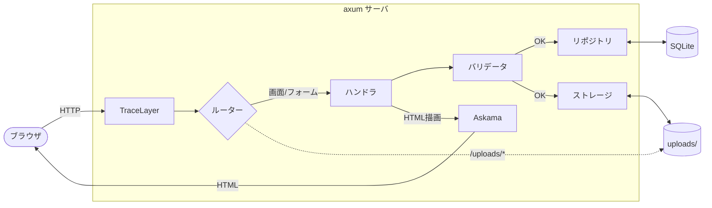
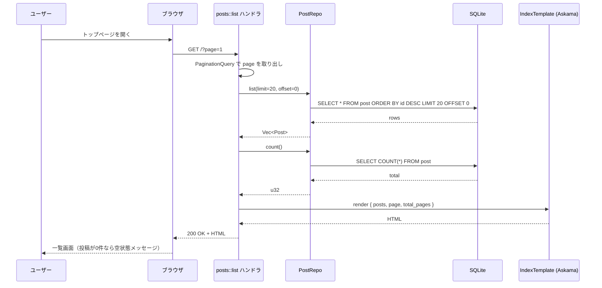
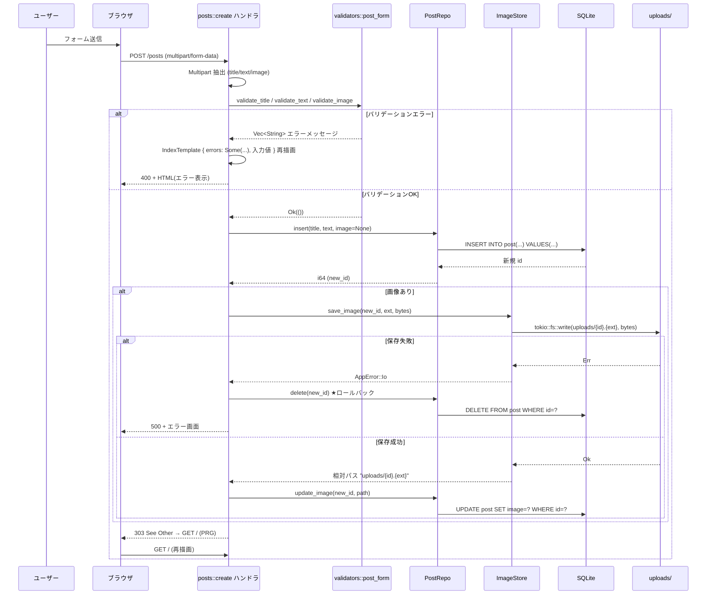
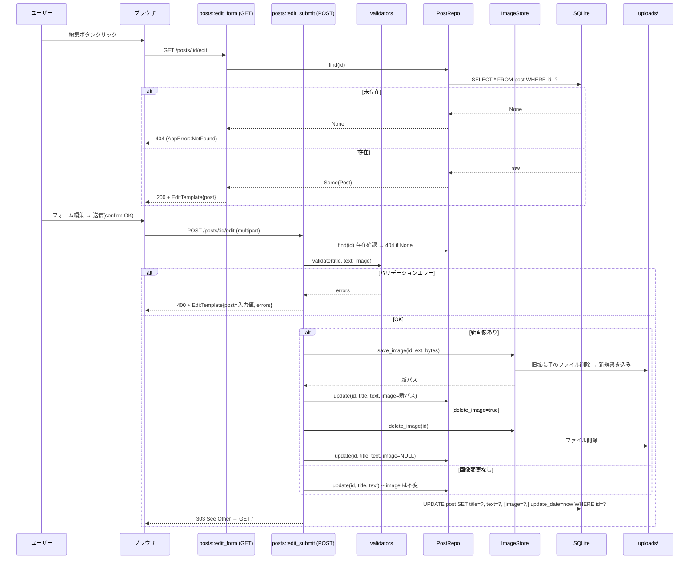
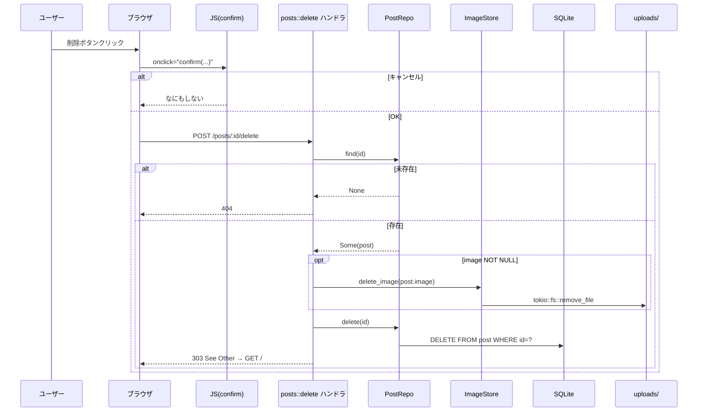

# rust-axum-image-bbs データフロー図

**作成日**: 2026-05-22
**関連アーキテクチャ**: [architecture.md](architecture.md)
**関連要件定義**: [../spec/requirements.md](../spec/requirements.md)

**【信頼性レベル凡例】**:
- 🔵 **青信号**: EARS要件定義書・ユーザヒアリングを参考にした確実なフロー
- 🟡 **黄信号**: EARS要件定義書・ユーザヒアリングから妥当な推測によるフロー
- 🔴 **赤信号**: 上記資料にない推測によるフロー

---

## システム全体のデータフロー 🔵

**信頼性**: 🔵 *要件定義・ユーザーストーリーより*



## 主要機能のデータフロー

### 機能1: 投稿一覧表示（Read） 🔵

**信頼性**: 🔵 *ユーザーストーリー 1.1・受け入れ基準 TC-001-* より*

**関連要件**: REQ-001, REQ-002, REQ-012, REQ-101



**詳細ステップ**:
1. axum が `GET /?page=N` を `posts::list` ハンドラへルーティング
2. `Query<PaginationQuery>` Extractor で `page` を取り出し、未指定なら 1
3. `PostRepo::list(limit=20, offset=(page-1)*20)` を呼び出し、`Vec<Post>` を取得
4. `PostRepo::count()` で総件数を取得し、`total_pages = ceil(total / 20)` を計算
5. `IndexTemplate { posts, page, total_pages, success_msg, errors: None }` を `into_response()`
6. Askama の自動エスケープで XSS を防いで HTML を返す

**信頼性メモ**: 旧PHP `DBImgbbs::SelectImgbbsAll` の `ORDER BY id DESC` を踏襲、ページングはヒアリング採用。

---

### 機能2: 投稿作成（Create + 画像アップロード） 🔵

**信頼性**: 🔵 *ユーザーストーリー 2.1 / 2.2・受け入れ基準 TC-004-* より*

**関連要件**: REQ-003, REQ-004, REQ-005, REQ-006, REQ-201, REQ-202, EDGE-001〜005, EDGE-101〜104



**詳細ステップ**:
1. axum の `axum::extract::DefaultBodyLimit::max(5MB)` で総バイト数を制限（EDGE-001）
2. `Multipart` Extractor でフィールドを順次取り出し、`title` / `text` / `image` を変数に格納
3. `validators::post_form::validate(title, text, image_meta)` を呼ぶ
   - title: 必須、1〜50文字（EDGE-101）
   - text: 0〜500文字（EDGE-102）
   - image: 任意。あればサイズ <= 5MB、MIME ∈ {jpeg, gif, png}（NFR-102, EDGE-002）
   - `infer::get(&bytes[..n])` でマジックナンバー検査
4. 失敗時: `IndexTemplate` を `errors` 付きで再描画（入力値は保持、REQ-201）
5. 成功時: `INSERT INTO post(title, text, image=NULL, regist_date=now, update_date=now)` で `last_insert_rowid` を取得
6. 画像があれば `uploads/{id}.{ext}` に保存し、`UPDATE post SET image=? WHERE id=?`
7. 画像保存失敗時は `DELETE FROM post WHERE id=?` でロールバック（EDGE-005、ヒアリング採用）
8. 完了後 `303 See Other` で `/` にリダイレクト（PRG パターン）

**信頼性メモ**: 旧PHP `index.php` + `DBImgbbs::InsertImgbbs/UpdateInsertImgbbs` の3ステップ構造を踏襲。

---

### 機能3: 投稿編集（Update） 🔵

**信頼性**: 🔵 *ユーザーストーリー 3.1〜3.3・受け入れ基準 TC-009-* より*

**関連要件**: REQ-008, REQ-009, REQ-103, REQ-104, EDGE-003



**詳細ステップ**:
1. `GET /posts/:id/edit`: `Path<i64>` で id 取得、`find(id)` で未存在なら 404（EDGE-003）
2. `EditTemplate{ post }` で既存値を表示
3. `POST /posts/:id/edit`: 同様に id 確認、バリデーション、画像処理
4. 画像差し替え時は旧拡張子ファイルも削除（prep.md 確認事項：拡張子変更時の挙動）
5. `delete_image=on` チェックボックスONの場合は image=NULL に更新 + ファイル削除（REQ-103）

**信頼性メモ**: 旧PHP `admin_edit.php` のロジックを踏襲し、欠落していた「画像のみ削除」「拡張子変更時の旧ファイル削除」を仕様化。

---

### 機能4: 投稿削除（Delete） 🔵

**信頼性**: 🔵 *ユーザーストーリー 4.1・受け入れ基準 TC-010-* より*

**関連要件**: REQ-010, REQ-011, REQ-102, NFR-105, EDGE-003



**詳細ステップ**:
1. クライアント側の `confirm("IDが「{id}」のデータを削除します...")` でユーザー確認（REQ-102）
2. OK のみ `POST /posts/:id/delete` を送信（GET は受けない、NFR-105）
3. `find(id)` で未存在なら 404、存在すれば画像ファイル削除 → レコード削除
4. 画像ファイル削除エラーは警告ログのみで処理を続行（孤児ファイルは許容、ベストエフォート）🟡

---

## データ処理パターン

### 同期処理（学習目的でも明示的に async） 🔵

**信頼性**: 🔵 *axum アーキテクチャより*

axum + tokio はすべて async なので、ハンドラ・リポジトリ・ストレージのIO関数はすべて `async fn` で書く。
ただしロジック上は逐次実行する処理ばかり（投稿のCRUDは1リクエスト1操作）。

### 非同期処理 🟡

**信頼性**: 🟡 *学習用途のため積極的な並列化はしない*

- バックグラウンド処理（サムネイル生成・画像最適化等）は今回スコープ外
- 必要があれば `tokio::spawn` を将来検討

### バッチ処理 🔴

**信頼性**: 🔴 *該当なし*

スコープ外。

---

## エラーハンドリングフロー 🔵

**信頼性**: 🔵 *ヒアリング「thiserror + IntoResponse」より*

```mermaid
flowchart TD
    Err[エラー発生] --> Cls{AppError 種別}
    Cls -->|Validation(Vec<String>)| V400[400 Bad Request + HTML再描画<br/>入力値保持]
    Cls -->|NotFound| V404[404 + シンプルなNotFoundページ]
    Cls -->|PayloadTooLarge| V413[413 + メッセージ]
    Cls -->|Io / Sqlx / Other| V500[500 + 簡易エラーHTML]

    V500 --> Log[tracing::error!]

    V400 --> Resp[HTML レスポンス]
    V404 --> Resp
    V413 --> Resp
    V500 --> Resp
    Resp --> Browser[ブラウザ]
```

**AppError 種別**（詳細は `errors.rs` / `interfaces.rs` 参照）:
- `Validation(Vec<String>)`: バリデーション失敗。ハンドラ側でテンプレ再描画を行うため、`IntoResponse` では使わず、ハンドラ内で吸収
- `NotFound`: レコードが見つからない（EDGE-003）
- `PayloadTooLarge`: 画像サイズ超過（EDGE-001）
- `Io(std::io::Error)`: ファイルI/O失敗（EDGE-005）
- `Sqlx(sqlx::Error)`: DB操作失敗（EDGE-004）
- `Other(anyhow::Error)`: その他想定外

**設計指針**:
- `IntoResponse for AppError` を実装し、500系は `tracing::error!` で構造化ログ
- ユーザーに見せるエラーメッセージは日本語、内部詳細は隠蔽

---

## 状態管理フロー

### サーバ状態（AppState の不変共有） 🔵

**信頼性**: 🔵 *ヒアリング・axum 慣用パターンより*

```mermaid
stateDiagram-v2
    [*] --> 起動: main()
    起動 --> 環境変数読込: dotenvy::dotenv
    環境変数読込 --> DB接続: SqlitePool::connect
    DB接続 --> マイグレーション: sqlx::migrate!()
    マイグレーション --> AppState構築: { db, upload_dir, config }
    AppState構築 --> Router構築: with_state(state)
    Router構築 --> サービング: axum::serve
    サービング --> サービング: 各リクエストで State<AppState> を Clone
    サービング --> [*]: SIGINT/SIGTERM
```

### リクエスト単位の状態 🟡

**信頼性**: 🟡 *axum 慣用パターンより*

- リクエスト間で状態は共有しない（リクエストごとに独立）
- `tower-http::trace::TraceLayer` が自動的に `request_id` を span に注入

---

## データ整合性の保証 🔵

**信頼性**: 🔵 *ヒアリング採用「INSERT → ファイル → UPDATE」より*

### Create 時のロールバック戦略

```
1. INSERT post(image=NULL) → new_id 取得
2. tokio::fs::write(uploads/{new_id}.{ext}, bytes)
   ↳ 失敗 → DELETE FROM post WHERE id=new_id して 500 を返す（補償トランザクション）
3. UPDATE post SET image=? WHERE id=new_id
   ↳ 失敗 → ファイル削除して 500 を返す（孤児ファイル防止）
```

### Update 時の整合性

- 新画像保存 → DB更新 の順。画像保存失敗時はDBを更新せず 500
- 画像のみ削除（チェックボックス）→ DB を image=NULL に更新 → ファイル削除（DB先・ファイル後）

### Delete 時の整合性

- DB から SELECT して image パスを把握 → ファイル削除 → DB DELETE
- ファイル削除失敗は警告ログのみで DB DELETE は実行（孤児ファイル ≪ DB レコード残存 の優先度）🟡

### SQLite のトランザクション

- 単発の `INSERT`/`UPDATE`/`DELETE` は SQLite 側で原子的なので明示的な `BEGIN` は不要
- 複数操作（DELETE post + 関連テーブル等）は今回スコープでは発生しない（テーブル1つ）

---

## 関連文書

- **アーキテクチャ**: [architecture.md](architecture.md)
- **型定義**: [interfaces.rs](interfaces.rs)
- **DBスキーマ**: [database-schema.sql](database-schema.sql)
- **エンドポイント仕様**: [api-endpoints.md](api-endpoints.md)
- **要件定義**: [../spec/requirements.md](../spec/requirements.md)
- **ヒアリング**: [design-interview.md](design-interview.md)

## 信頼性レベルサマリー

- 🔵 青信号: 18件 (約75%)
- 🟡 黄信号: 5件 (約21%)
- 🔴 赤信号: 1件 (約4%) — バッチ処理セクション（該当なしの明示）

**品質評価**: 高品質
