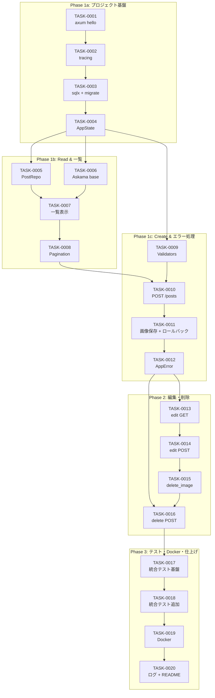

# rust-axum-image-bbs タスク分割 概要

- **作成日**: 2026-05-22
- **更新日**: 2026-05-22（Phase 1 を 1a/1b/1c に分割、Zenn まとめ記事仕様を追加）
- **対象プロジェクト**: rust-axum-image-bbs（旧PHP画像掲示板の Rust + axum 再実装）
- **推定総工数**: 80 時間（4h × 20タスク）+ まとめ記事5本 ≒ 10時間
- **総タスク数**: 20 件
- **フェーズ数**: 5（Phase 1a/1b/1c/2/3）
- **想定 Zenn 記事数**: 20本（個別タスク） + 5本（フェーズまとめ） = 約25本

## 関連文書

### 要件 / ヒアリング
- [📋 要件定義](../spec/requirements.md)
- [🎤 ヒアリング記録](../spec/interview-record.md)
- [✅ 受け入れ基準](../spec/acceptance-criteria.md)
- [📝 ユーザーストーリー](../spec/user-stories.md)
- [📌 prep ノート](../spec/prep.md)
- [🗒️ 補足ノート](../spec/note.md)

### 設計
- [📐 アーキテクチャ](../design/architecture.md)
- [📊 データフロー](../design/dataflow.md)
- [🧩 型定義（Rust interfaces）](../design/interfaces.rs)
- [🗄️ DB スキーマ](../design/database-schema.sql)
- [🔌 API エンドポイント](../design/api-endpoints.md)
- [🎤 設計ヒアリング](../design/design-interview.md)

## フェーズ構成

| Phase | 目的 | タスク数 | 工数 | マイルストーン |
|---|---|---|---|---|
| Phase 1a | プロジェクト基盤（axum 起動・tracing・DB 接続・AppState） | 4 | 16h | M1: 基盤完成 |
| Phase 1b | Read & 一覧表示（Post モデル・Repository・Askama・一覧・ページング） | 4 | 16h | M2: 一覧表示完成 |
| Phase 1c | Create & エラー処理（バリデータ・投稿作成・画像 + ロールバック・AppError） | 4 | 16h | M3: 投稿作成完成 |
| Phase 2 | 編集・削除機能（CRUD のうち U / D の実装） | 4 | 16h | M4: CRUD完成 |
| Phase 3 | テスト基盤・Docker・ログ仕上げ | 4 | 16h | M5: 配布可能化 |

### マイルストーン

- **M1: 基盤完成** … TASK-0001 〜 TASK-0004 完了。axum サーバが立ち上がり、TraceLayer・sqlx + マイグレーション・AppState が動作する状態。
- **M2: 一覧表示完成** … TASK-0005 〜 TASK-0008 完了。Post モデル・Repository・Askama テンプレが結線され、ページネーション付きで一覧表示が動く。
- **M3: 投稿作成完成** … TASK-0009 〜 TASK-0012 完了。バリデータ・投稿作成（画像保存 + ロールバック）・共通エラー処理まで通る。
- **M4: CRUD完成** … TASK-0013 〜 TASK-0016 完了。編集・画像のみ削除・投稿削除まで実装され、画像掲示板として一通り使える。
- **M5: 配布可能化** … TASK-0017 〜 TASK-0020 完了。統合テスト・Docker・構造化ログ・README が整い、Zenn 記事化と読者の手元再現が可能。

---

## Zenn 記事生成仕様

本プロジェクトの Zenn 記事は **二層構造** で執筆する:

### 1. 個別タスク記事（20本）

各タスクファイル（TASK-XXXX.md）に含まれる **「Zenn 記事ドラフト」** セクションをベースに、タスク1本=記事1本で執筆する。
1記事あたりの想定文字数は2000〜4000字、実装後に詰まりやすかった点を補足する。

**配置**: `articles/rust-axum-imgbbs-XX-slug.md`（Zenn CLI フォーマット、フロントマター付き）
- `XX` はタスク番号と1:1対応（01, 02, ...）
- `slug` は内容を表す短い識別子（例: `init`, `tracing`, `migration`, `appstate`）
- 公開前は `published: false`、公開時のみ `true` に変更
- 記事生成後は対応タスクファイルの「Zenn 記事ドラフト」セクション冒頭に **「📝 記事生成済み」** タグと相対リンクを追記する

### 2. フェーズまとめ記事（5本）

各フェーズ（Phase 1a / 1b / 1c / 2 / 3）の完了時に、そのフェーズの**俯瞰記事**を1本追記する。
個別記事を全部読まなくても「このフェーズで何ができるようになるか」が分かるレベル。

#### フェーズまとめ記事の構成テンプレ

各まとめ記事は下記の見出しで構成する:

1. **このフェーズで作るもの**（スクショ・動作例）
2. **このフェーズの学習ポイント**（3〜5項目）
3. **タスクの流れと依存関係**（依存図 + 各タスクへのリンク）
4. **詰まりやすかったポイントとリカバリ**（実装時の気づき）
5. **次のフェーズで何をやるか**（次フェーズの予告）

#### フェーズまとめ記事の対応表

| フェーズ | まとめ記事タイトル案 | 対象タスク |
|---|---|---|
| Phase 1a | 「Rust + axum で画像掲示板を作る まとめ① 〜プロジェクト基盤を組み立てる〜」 | TASK-0001 〜 TASK-0004 |
| Phase 1b | 「Rust + axum で画像掲示板を作る まとめ② 〜SQLite と Askama で一覧表示を実装する〜」 | TASK-0005 〜 TASK-0008 |
| Phase 1c | 「Rust + axum で画像掲示板を作る まとめ③ 〜画像アップロードとエラー処理を整える〜」 | TASK-0009 〜 TASK-0012 |
| Phase 2 | 「Rust + axum で画像掲示板を作る まとめ④ 〜編集と削除で CRUD を完成させる〜」 | TASK-0013 〜 TASK-0016 |
| Phase 3 | 「Rust + axum で画像掲示板を作る まとめ⑤ 〜統合テスト・Docker・READMEで配布できるようにする〜」 | TASK-0017 〜 TASK-0020 |

#### まとめ記事の運用ルール

- フェーズの最終タスク完了直後に、そのフェーズのまとめ記事を執筆（執筆工数の目安は1本2時間）
- 個別記事は技術詳細にフォーカス、まとめ記事は学習の地図にフォーカス
- まとめ記事のリンクから個別タスク記事へ繋ぐ「目次的記事」として機能させる
- 完成した連載は Zenn の Books 機能でも一冊にまとめられる構成にする

#### 配置: `articles/`

```
articles/
├── rust-axum-imgbbs-01-init.md             ← TASK-0001 (生成済み)
├── rust-axum-imgbbs-02-tracing.md          ← TASK-0002
├── rust-axum-imgbbs-03-sqlx-migration.md   ← TASK-0003
├── rust-axum-imgbbs-04-appstate.md         ← TASK-0004
├── rust-axum-imgbbs-05-postrepo.md         ← TASK-0005
├── ...
├── rust-axum-imgbbs-20-readme.md           ← TASK-0020
├── rust-axum-imgbbs-phase1a-summary.md     ← Phase 1a まとめ
├── rust-axum-imgbbs-phase1b-summary.md     ← Phase 1b まとめ
├── rust-axum-imgbbs-phase1c-summary.md     ← Phase 1c まとめ
├── rust-axum-imgbbs-phase2-summary.md      ← Phase 2 まとめ
└── rust-axum-imgbbs-phase3-summary.md      ← Phase 3 まとめ
```

#### 進捗

| 記事 | 状態 | ファイル |
|---|---|---|
| (01) プロジェクト初期化と Hello, axum! | ✅ 生成済み | [articles/rust-axum-imgbbs-01-init.md](../../../../articles/rust-axum-imgbbs-01-init.md) |
| (02) tracing で構造化ログを入れる | 未生成 | - |
| (03) sqlx + SQLite マイグレーション | 未生成 | - |
| (04) AppState / AppConfig と環境変数 | 未生成 | - |
| 以降... | 未生成 | - |

---

## タスク一覧

### Phase 1a: プロジェクト基盤（16h）

> ゴール: axum サーバが立ち上がり、構造化ログ・DB・AppState が動く骨組み完成。
> このフェーズ完了で「Rust の Web 開発はこういう感じか」が掴めるところまで。

- [ ] [TASK-0001](TASK-0001.md): プロジェクト初期化と axum 最小起動 — DIRECT, 4h
- [x] [TASK-0002](TASK-0002.md): tracing + tower-http TraceLayer 導入 — DIRECT, 4h ✅ 完了 (2026-05-23)
- [ ] [TASK-0003](TASK-0003.md): SQLite + sqlx 接続とマイグレーション — DIRECT, 4h
- [ ] [TASK-0004](TASK-0004.md): AppConfig / AppState 設計と環境変数読み込み — DIRECT, 4h

📝 **Phase 1a 完了時に書くまとめ記事**: 「まとめ① プロジェクト基盤を組み立てる」

### Phase 1b: Read & 一覧表示（16h）

> ゴール: DB から取得した投稿を、Askama テンプレートで一覧表示できる。
> ページング付き。

- [ ] [TASK-0005](TASK-0005.md): Post モデルと Repository(list/count/find) 実装 — TDD, 4h
- [ ] [TASK-0006](TASK-0006.md): Askama base.html + index.html 雛形 — DIRECT, 4h
- [ ] [TASK-0007](TASK-0007.md): GET / 投稿一覧表示 — TDD, 4h
- [ ] [TASK-0008](TASK-0008.md): ページネーション実装 — TDD, 4h

📝 **Phase 1b 完了時に書くまとめ記事**: 「まとめ② SQLite と Askama で一覧表示を実装する」

### Phase 1c: Create & エラー処理（16h）

> ゴール: 画像付き投稿ができ、バリデーション・ロールバック・共通エラーが整う。
> Rust の `Result` / `?` / `thiserror` の活用が一通り体験できる山場。

- [ ] [TASK-0009](TASK-0009.md): バリデータと ImageExt 型 — TDD, 4h
- [ ] [TASK-0010](TASK-0010.md): POST /posts 投稿作成（画像なし版） — TDD, 4h
- [ ] [TASK-0011](TASK-0011.md): 画像アップロード + ImageStore + ロールバック — TDD, 4h
- [ ] [TASK-0012](TASK-0012.md): AppError + IntoResponse 実装 — TDD, 4h

📝 **Phase 1c 完了時に書くまとめ記事**: 「まとめ③ 画像アップロードとエラー処理を整える」

### Phase 2: 編集・削除（16h）

> ゴール: CRUD のうち U / D を完成させ、画像掲示板として一通り使える状態に。

- [ ] [TASK-0013](TASK-0013.md): GET /posts/:id/edit 編集画面表示 — TDD, 4h
- [ ] [TASK-0014](TASK-0014.md): POST /posts/:id/edit 編集処理 — TDD, 4h
- [ ] [TASK-0015](TASK-0015.md): 画像のみ削除（delete_image チェックボックス）対応 — TDD, 4h
- [ ] [TASK-0016](TASK-0016.md): POST /posts/:id/delete 削除処理 — TDD, 4h

📝 **Phase 2 完了時に書くまとめ記事**: 「まとめ④ 編集と削除で CRUD を完成させる」

### Phase 3: テスト・Docker・仕上げ（16h）

> ゴール: 統合テスト・Docker 化・README 整備により、読者が手元で再現できる完成形に。

- [ ] [TASK-0017](TASK-0017.md): 統合テスト基盤整備 — TDD, 4h
- [ ] [TASK-0018](TASK-0018.md): 主要機能の統合テスト追加 — TDD, 4h
- [ ] [TASK-0019](TASK-0019.md): Dockerfile + docker-compose.yml — DIRECT, 4h
- [ ] [TASK-0020](TASK-0020.md): tracing 構造化ログ仕上げ + README 整備 — DIRECT, 4h

📝 **Phase 3 完了時に書くまとめ記事**: 「まとめ⑤ 統合テスト・Docker・READMEで配布できるようにする」

---

## 依存関係

### Mermaid 図



### 主な分岐ポイント

- TASK-0004 から TASK-0005 / 0006 / 0009 へ3分岐（ドメイン層・テンプレ層・バリデータが並行可能）
- TASK-0012 完了で Phase 2 入口（TASK-0013, 0016 が前提条件を満たす）
- TASK-0015 と TASK-0014 はどちらも編集ハンドラを触るため、順序で衝突を避ける

## クリティカルパス

最長の依存チェーンは下記の通り（20タスクが直列に近い構造）。

```
TASK-0001 → 0002 → 0003 → 0004 → 0005 → 0007 → 0008 → 0010 → 0011 → 0012 → 0013 → 0014 → 0015 → 0016 → 0017 → 0018 → 0019 → 0020
```

- TASK-0006 / 0009 は分岐枝で並行実施可能だが、後段で合流するため工数短縮幅は限定的（4h 程度）。
- 実際の所要日数: 1人で進めると約 10 営業日（1日 8h、1日2タスク想定）+ まとめ記事執筆 5日分。

## 信頼性レベルサマリー

各タスクファイル末尾の信頼性レベルを集計した目安。

- 🔵 青信号（要件・設計文書に直接対応）: 全体の約 80%
- 🟡 黄信号（妥当な推測・実装裁量）: 全体の約 20%
- 🔴 赤信号（推測のみ）: 0 件

設計文書（architecture / dataflow / interfaces / database-schema / api-endpoints）と要件定義に
強く紐付くタスクが大半で、ヒアリング採用済みの技術選定（axum 0.7 / sqlx 0.8 / Askama 0.12）
からも青信号比率が高い。

## 想定スケジュール（目安）

| 週 | 進捗目標 | 主なタスク | まとめ記事 |
|---|---|---|---|
| Week 1 | M1 + M2 到達 | TASK-0001 〜 0008 | ① ② を執筆 |
| Week 2 | M3 到達 | TASK-0009 〜 0012 | ③ を執筆 |
| Week 3 | M4 到達 | TASK-0013 〜 0016 | ④ を執筆 |
| Week 4 | M5 到達 | TASK-0017 〜 0020 | ⑤ を執筆 |

各週末で個別記事の下書きを 4〜5 本まとめ、フェーズ末でまとめ記事を書く流れ。
最終的に 20 本の個別記事 + 5 本のまとめ記事 = 約25本の連載になる想定。

## 次のステップ

タスクファイルが揃ったので、実装フェーズに進む:

1. 各タスクファイルの「実装手順」セクションに従って TDD / DIRECT のフローを実行
2. 一括自動実行する場合は `/tumigi:kairo-implement` を起動し、TASK-0001 から順に処理
3. 詰まったタスクは `/tumigi:dcs:bug-analysis` や `/tumigi:auto-debug` で深掘り
4. 完了したタスクは チェックボックスにチェックを入れる（PR 単位で1〜2タスク推奨）
5. 各フェーズの最終タスク完了直後に、まとめ記事を執筆（上記「Zenn 記事生成仕様」セクション参照）

## ファイル構成

```
docs/tumigidoc/rust-axum-image-bbs/tasks/
├── overview.md         ← 本ファイル
├── TASK-0001.md  (Phase 1a)
├── TASK-0002.md  (Phase 1a)
├── TASK-0003.md  (Phase 1a)
├── TASK-0004.md  (Phase 1a)
├── TASK-0005.md  (Phase 1b)
├── TASK-0006.md  (Phase 1b)
├── TASK-0007.md  (Phase 1b)
├── TASK-0008.md  (Phase 1b)
├── TASK-0009.md  (Phase 1c)
├── TASK-0010.md  (Phase 1c)
├── TASK-0011.md  (Phase 1c)
├── TASK-0012.md  (Phase 1c)
├── TASK-0013.md  (Phase 2)
├── TASK-0014.md  (Phase 2)
├── TASK-0015.md  (Phase 2)
├── TASK-0016.md  (Phase 2)
├── TASK-0017.md  (Phase 3)
├── TASK-0018.md  (Phase 3)
├── TASK-0019.md  (Phase 3)
└── TASK-0020.md  (Phase 3)
```
